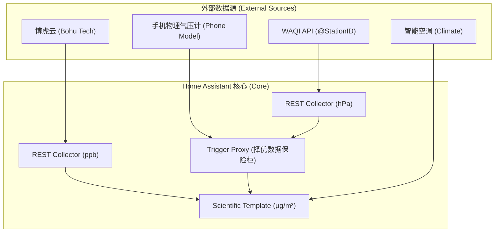

# 博虎臭氧监测与环境监控系统集成指南

> **版本**: v1.1 (2026-04-20) - 新增手机传感器支持
> **作者**: AreaSongWcc v7.0 & User
> **核心目标**: 实现高可用、科学修正、双源补正的室内臭氧 (O3) 监控系统。

---

## 1. 系统架构图

本系统采用“解耦+择优中介”的架构模式，实现了物理传感器与云端 API 的完美融合。

---

## 2. 核心模块详解

### 2.1 原始数据采集 (REST Collector)
*   **博虎 REST**: 直接对接 `latest` 接口，绕过私有云 App，实现 60s 级同步。
*   **WAQI 原始 API**: 通过 Token 直连目标站点，不依赖 HA 官方组件，稳定性更高。

### 2.2 择优中介层 (Priority-based Proxy)
**作用**: 整合本地物理传感器与远程 API 数据。
*   **设计逻辑**:
    1.  **优先级 1 (手机物理计)**: 手机自带气压计能直接反应所在位置的真实物理压力，精度最高。
    2.  **优先级 2 (测站 API)**: 当手机不在家或 App 掉线时，自动切换回 WAQI 测站数据。
    3.  **优先级 3 (保底值)**: 全线断流时，使用 1013.25 hPa 进行保底。
*   **触发器机制**: 订阅手机与 API 实体的双重状态变化，确保数据永远在线。

### 2.3 科学单位换算 (Scientific Template)
*   **物理修正**: 实时引入 $T$ (温度) 和 $P$ (气压) 进行动态换算。
*   **自动兼容**: 代码自动识别 hPa 与 kPa，兼容不同来源的数据单位。

---

## 3. 运维与预警建议

### 3.1 预警阈值设置 (广州/中国标准)

| 状态 | μg/m³ 指标 | 对等 ppb 读数 |
| :--- | :--- | :--- |
| **🟢 正常** | < 100 | < 51 |
| **🟡 预警** | **100** | **51** |
| **🔴 告警** | **160** | **82** |

### 3.2 经验总结
1. **就近原则**: 能用物理传感器（如手机、Zigbee 气压计）就不用 API，物理压力最能反映真实环境的空气密度。
2. **锁死大法**: 通过 `trigger-based template` 锁死最后一次有效值，是处理“偶尔抽风”的云端 API 的万能金钥匙。
3. **Availability 护航**: 在计算模板中加入可用性检查，能有效防止 HA 启动时的误报。

---

## 4. 相关文件
*   [configuration.yaml.example](./configuration.yaml.example): 完整代码备份。
